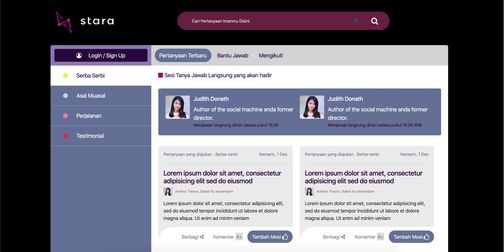
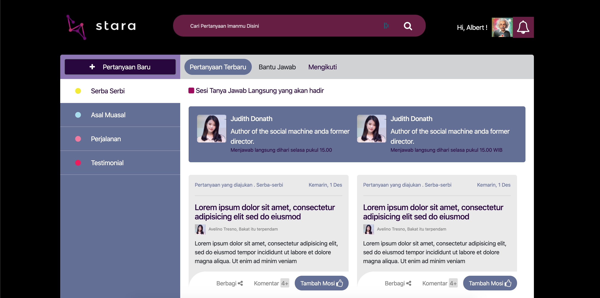
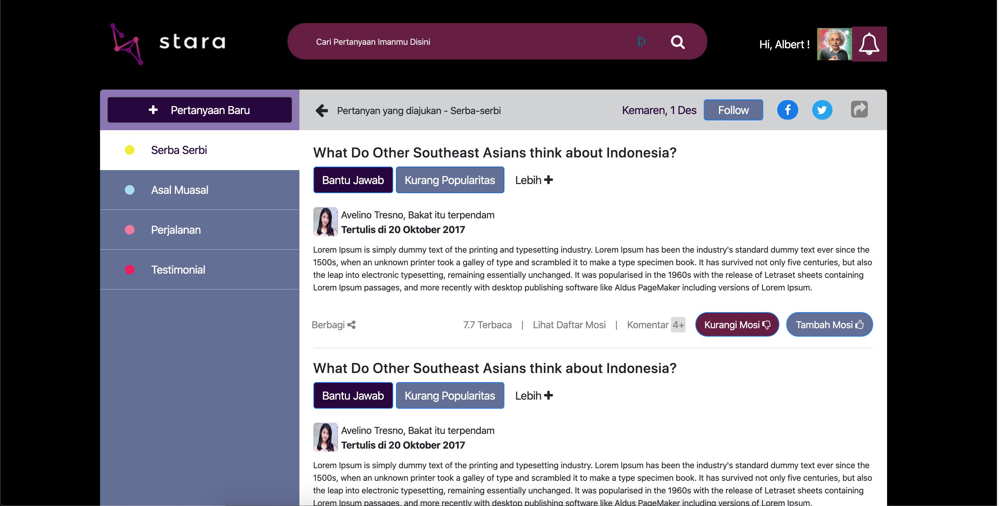
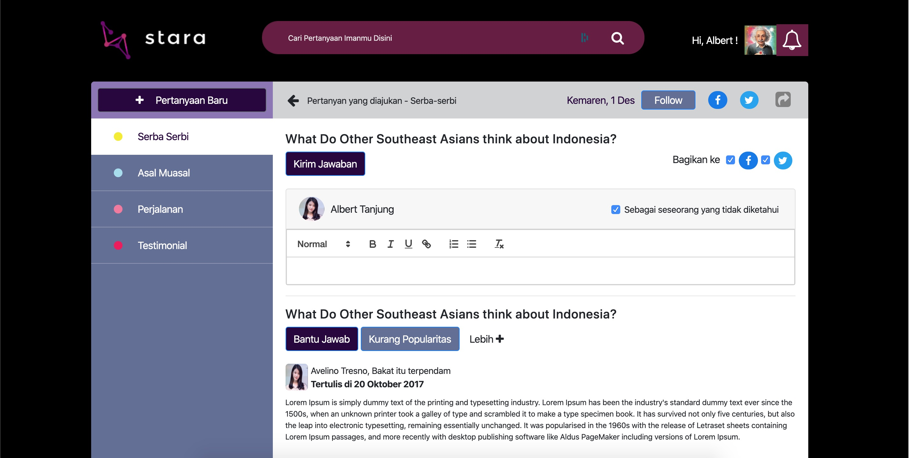
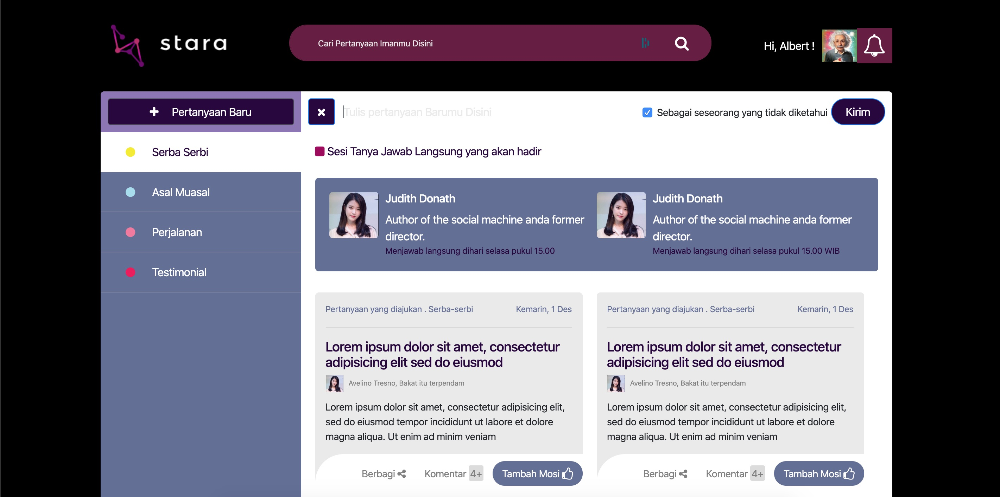
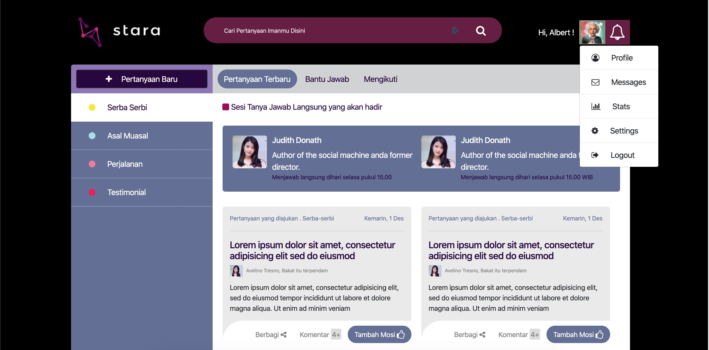
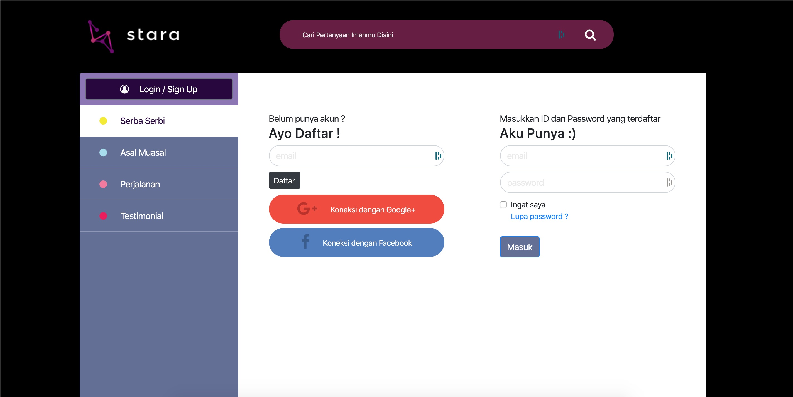

# Task Batara Guru
## Setup
You can run in root web server or use Live-Server npm package :

`npm install -g live-server`

and then run in your root project folder :

`live-server`

## Screenshots
Page 1

Page 2

Page 3

Page 4

Page 5

Page 6

Page 7

